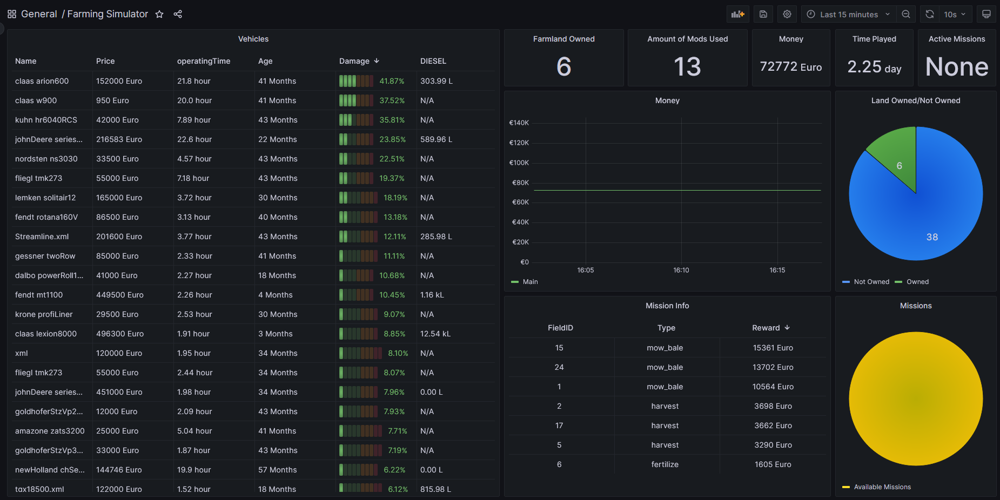

# FarmingSimulatorExporter
Farming Simulator 22 exporter for Prometheus 

Provides information about:
- Vehicles (damage, fuel, age, ...)
- Farmland 
- Missions
- Economy
- Savegame info (time played, money... )
## Usage
The exporter requires beautifulsoup, lxml and prometheus-client which can be installed using

```
pip install beautifulsoup4 lxml prometheus-client
```

Run

```
python3 .\files\fs22ex.py "<pathtosavegame>"
```

to start the exporter. Savegame files are usually located at `C:\Users\<name>\OneDrive\Documents\My Games\FarmingSimulator2022\savegameX` 

To see the metrics go to http://localhost:9321
## Prometheus configuration
When running prometheus on the same device as the exporter following configuration can be used:

``` 
- job_name: 'fs22'
  static_configs:
    - targets:
      - localhost:9321
```

If prometheus is on an other device please use following configuration:

``` 
- job_name: 'fs22'
  static_configs:
    - targets:
      - <ipaddress>:9321
```

## Dashboard
In addition a Grafana dashboard is provided.



## Extra
The Farming Simulator Exporter is inspired by:
https://www.robustperception.io/writing-a-jenkins-exporter-in-python/

and uses following libraries
- BeautifulSoup
- lxml
- [prometheus_client](https://github.com/prometheus/client_python)